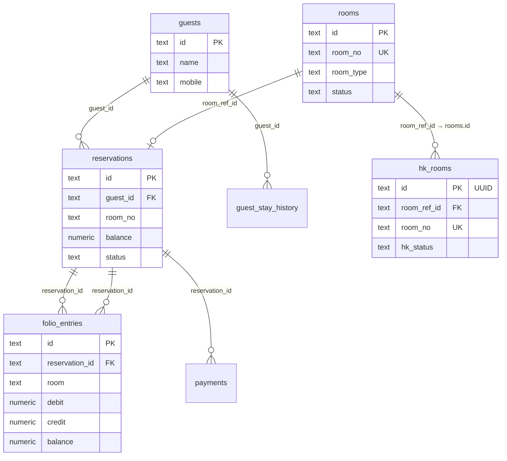

# Core entity schemas — Rooms, Bookings, Guests & Folio

Reference for the main Front Office + Housekeeping tables used across the PMS.

| Entity | Table | SQL source | API base |
|--------|-------|------------|----------|
| Room master (FO) | `rooms` | `front-office-schema.sql` | `/api/front-office/rooms` |
| HK room ops | `hk_rooms` | `housekeeping-schema.sql` | `/api/housekeeping/rooms` |
| Booking master | `reservations` | `front-office-schema.sql` | `/api/front-office/reservations` |
| Guest profile | `guests` | `front-office-schema.sql` | `/api/front-office/guests` |
| Guest folio | `folio_entries` | `front-office-schema.sql` | `/api/front-office/folio` |

**Setup order:** run `front-office-schema.sql` first, then `housekeeping-schema.sql`.  
For existing HK databases, run `housekeeping-patch-room-ref.sql` (adds `room_ref_id` + UUID ids).  
For existing FO databases with legacy booking columns, run `reservations-normalize-refs-fix-fk.sql`.  
For UUID primary keys on FO rooms, run `rooms-uuid-pk.sql`.  
For UUID primary keys on reservations, run `reservations-uuid-pk.sql`.  
For UUID primary keys on guests, run `guests-uuid-pk.sql`.  
For `source_id` on reservations + UUID booking sources, run `reservations-source-id.sql`.

API field names are **camelCase** in JSON (e.g. `roomNo`, `guestId`); database columns are **snake_case**.

---

## Entity relationship



---

## 1. Room master — `rooms`

**Purpose:** Front Office inventory — physical rooms, live occupancy snapshot, floor plan, availability.

**Primary key:** `id` — **UUID v4**

**Business key:** `room_no` — unique room number shown in UI (e.g. `"101"`, `"204"`)

| Column | Type | Default | Description |
|--------|------|---------|-------------|
| `id` | text | UUID | **PK.** Use for API updates when available |
| `room_no` | text | — | **Unique.** Room number shown in UI |
| `room_type` | text | — | Category name (e.g. Standard, Deluxe, Suite) |
| `floor` | text | `''` | Floor label (e.g. `1st Floor`) |
| `status` | text | `Vacant` | FO status: Vacant, Occupied, Blocked, Maintenance, Dirty, … |
| `guest_name` | text | null | Current in-house guest (denormalized) |
| `housekeeping` | text | `Clean` | HK summary on FO view: Clean, Dirty, … |
| `maintenance` | text | `OK` | Maintenance flag: OK, In Progress, … |
| `checkout_date` | text | null | Expected checkout (display string) |
| `created_at` | timestamptz | now() | Row created |

**API**

- `GET /api/front-office/rooms` — list (optional `?status=`)
- `GET /api/front-office/rooms/:id` — `:id` = UUID or `room_no` (backward compatible)
- `GET /api/front-office/rooms/availability` — calendar grid
- `GET /api/front-office/rooms/status` — status cards for dashboard

**Related masters:** `room_types` (type definitions, rates, amenities) — separate table, linked by name/code in `room_type` column.

**Patch (existing DB):** `rooms-uuid-pk.sql`

---

## 2. HK rooms — `hk_rooms`

**Purpose:** Housekeeping operational record per physical room — cleaning state, inspection, staff assignment, DND, photos.

**Primary key:** `id` — **UUID v4** (generated on create / migration)

**Business keys**

| Column | Role |
|--------|------|
| `room_ref_id` | **FK → `rooms.id`** — link to FO room master |
| `room_no` | Unique display number (usually same as `room_ref_id`) |

| Column | Type | Default | Description |
|--------|------|---------|-------------|
| `id` | text | UUID | **PK.** Use for all HK API paths (`/rooms/:id/...`) |
| `room_ref_id` | text | null | FK to `rooms(id)` |
| `room_no` | text | — | **Unique.** Room number for lists / labels |
| `category` | text | `Standard` | HK category (Standard, Deluxe, Suite, …) |
| `type` | text | null | Room type label (often mirrors category) |
| `bed_type` | text | `King` | King, Queen, Twin, … |
| `floor` | text | `''` | Floor |
| `wing` | text | `''` | Wing / block |
| `max_occupancy` | int | 2 | Max guests |
| `cleaning_frequency` | text | `Daily` | Daily, Stay-over, Weekly, … |
| `deep_cleaning_frequency` | text | `Every 30 Days` | Deep-clean schedule |
| `last_deep_cleaned` | text | `''` | Last deep clean date (display) |
| `status` | text | `Vacant Dirty` | Composite HK UI status (see below) |
| `hk_status` | text | `Dirty` | Clean, Dirty, Cleaning, Inspected, OOO, OOS |
| `fo_status` | text | `Vacant` | Vacant, Occupied, Blocked (synced with FO) |
| `dnd` | boolean | false | Do not disturb |
| `sleep_out` | boolean | false | Guest sleep-out flag |
| `facilities` | jsonb | `[]` | Amenities list |
| `remarks` | text | `''` | Notes |
| `assigned_staff` | text | null | Housekeeper name |
| `assigned_supervisor` | text | null | Supervisor for inspection |
| `cleaning_timer` | jsonb | null | `{ startedAt, elapsedSeconds, paused, lastTick }` |
| `cleaning_progress` | int | 0 | 0–100 |
| `photos` | jsonb | `[]` | Inspection / cleaning photo URLs |
| `inspection_history` | jsonb | `[]` | Array of inspection records |
| `guest_name` | text | null | Denormalized from FO |
| `checkout_date` | text | null | Denormalized from FO |
| `housekeeping` | text | null | Optional HK label |
| `maintenance` | text | `OK` | OK, In Progress, … |
| `created_at` | timestamptz | now() | |
| `updated_at` | timestamptz | now() | |

**Typical `status` values:** Vacant Ready, Vacant Dirty, Occupied, Occupied Dirty, Cleaning, Inspection Pending, Blocked, Out of Order, Out of Service

**API**

- CRUD: `GET|POST /api/housekeeping/rooms`, `PUT /api/housekeeping/rooms/:id`
- Ops: `POST /rooms/:id/start-clean`, `pause-clean`, `complete-clean`, `inspect`, `mark-dirty`

**Create payload (frontend):** send `roomRefId` + `roomNo` from FO master; **do not** send `id` — backend assigns UUID.

**Patch (existing DB):** `housekeeping-patch-room-ref.sql`; after FO rooms UUID migration, `rooms-uuid-pk.sql` remaps `room_ref_id` → `rooms.id`

---

## 3. Booking master — `reservations`

**Purpose:** All bookings / reservations — from confirmation through check-in, in-house stay, check-out.

**Primary key:** `id` — **UUID v4** (generated by API on create)

**Foreign keys**

| Column | References |
|--------|------------|
| `guest_id` | `guests(id)` ON DELETE RESTRICT — **required** |
| `room_ref_id` | `rooms(id)` ON DELETE SET NULL — assigned room UUID |
| `source_id` | `booking_sources(id)` ON DELETE SET NULL — booking channel |

| Column | Type | Default | Description |
|--------|------|---------|-------------|
| `id` | text | UUID | **PK.** Booking UUID |
| `guest_id` | text | — | **FK** → `guests.id` |
| `room_ref_id` | text | null | **FK** → `rooms.id` (UUID) |
| `source_id` | text | null | **FK** → `booking_sources.id` (UUID) |
| `check_in` | text | — | Check-in date (display string) |
| `check_out` | text | — | Check-out date |
| `balance` | numeric | 0 | Outstanding folio balance |
| `status` | text | `Confirmed` | Booking lifecycle status |
| `arriving_today` | boolean | false | Arrival flag |
| `booking_type` | text | `Individual` | Individual / Company |
| `company_name` | text | null | Corporate name |
| `adults` | int | 1 | |
| `children` | int | 0 | |
| `nights` | int | 1 | Length of stay |
| `tariff_plan` | text | null | Rate plan code |
| `meal_plan` | text | null | EP, CP, MAP, … |
| `room_rate` | numeric | 0 | Nightly rate |
| `total_amount` | numeric | 0 | Total booking value |
| `advance_paid` | numeric | 0 | Advance collected |
| `payment_mode` | text | null | Cash, Card, UPI, … |
| `special_requests` | text | null | |
| `booked_by` | text | null | Agent / staff who booked |
| `created_at` | text | null | Booking timestamp (display) |
| `restaurant_bill` | numeric | 0 | F&B charges summary |
| `laundry` | numeric | 0 | Laundry charges summary |
| `is_vip` | boolean | false | VIP flag |

**Enriched at API layer (from `guests` + `rooms` + `booking_sources`):** `guestName`, `phone`, `email`, identity fields, `roomNo`, `roomType`, `source` (display name)

**Status values:** Confirmed, Reserved, Checked In, In-House, Checked Out, Cancelled

**API**

- `GET /api/front-office/reservations` — list (`?status=`) — returns enriched DTO
- `GET /api/front-office/reservations/summary` — dashboard counts
- `GET /api/front-office/reservations/in-house` — in-house guests
- `GET|POST|PUT|DELETE /api/front-office/reservations/:id`
- `POST /reservations/:id/check-in`, `check-out`, `extend-stay`

**Create payload:** `guestId` (required) + optional `roomRefId` + optional `sourceId` + booking-specific fields only.

**Patch (existing DB):** `reservations-normalize-refs-fix-fk.sql`; `reservations-uuid-pk.sql`; `reservations-source-id.sql` for `source` text → `source_id` FK

**Related:** `guest_stay_history` — past stays per guest (`guest_id` FK).

---

## 4. Guest profile — `guests`

**Purpose:** Master guest CRM record — identity, loyalty, preferences, stay history link.

**Primary key:** `id` — **UUID v4** (generated by API on create)

| Column | Type | Default | Description |
|--------|------|---------|-------------|
| `id` | text | UUID | **PK.** Guest UUID |
| `name` | text | — | Full name |
| `mobile` | text | `''` | Primary phone |
| `email` | text | `''` | |
| `nationality` | text | `''` | |
| `total_stays` | int | 0 | Lifetime stay count |
| `loyalty_points` | int | 0 | Loyalty balance |
| `id_type` | text | null | ID document type |
| `id_number` | text | null | Masked / stored ID |
| `address` | text | null | |
| `member_since` | text | null | Loyalty enrolment date |
| `preferences` | text[] | `{}` | e.g. `{ "Non-smoking", "High floor" }` |
| `gender` | text | null | |
| `dob` | text | null | |
| `city` | text | null | |
| `state` | text | null | |
| `country` | text | null | |
| `pincode` | text | null | |
| `created_at` | timestamptz | now() | |

**API:** CRUD at `/api/front-office/guests`  
**Stay history:** `/api/front-office/guest-stay-history?guestId=…`

**Link to bookings:** `reservations.guest_id` → `guests.id`

**Patch (existing DB):** `guests-uuid-pk.sql` for legacy `G-*` ids → UUID

---

## 5. Guest folio — `folio_entries`

**Purpose:** Running account (ledger) for an in-house guest — room charges, F&B, laundry, payments, taxes.

There is no separate `folio` header table; the folio **is** the ordered list of `folio_entries` for a room / reservation.

**Primary key:** `id` (e.g. `FE-01`)

**Foreign keys**

| Column | References |
|--------|------------|
| `reservation_id` | `reservations(id)` ON DELETE SET NULL |

| Column | Type | Default | Description |
|--------|------|---------|-------------|
| `id` | text | — | **PK.** Folio line ID |
| `guest_name` | text | — | Guest name (denormalized) |
| `room` | text | — | Room number |
| `reservation_id` | text | null | **FK** → booking |
| `date` | text | — | Transaction date (display) |
| `description` | text | — | Line description |
| `category` | text | — | Room, Restaurant, Laundry, Payment, Tax, Other |
| `debit` | numeric | 0 | Charge (+) |
| `credit` | numeric | 0 | Payment / credit (−) |
| `balance` | numeric | 0 | Running balance after line |
| `created_at` | timestamptz | now() | |

**Folio logic**

- **Debit** increases what the guest owes (room night, restaurant, laundry).
- **Credit** reduces balance (payments, advances).
- **Balance** on each line is the running total (can be negative if overpaid).

**API**

- `GET|POST /api/front-office/folio`
- `GET /api/front-office/folio?room=112`
- `GET /api/front-office/folio?reservationId=BK-1040`

**Related billing tables**

| Table | Purpose |
|-------|---------|
| `payments` | Payment transactions linked to `reservation_id` |
| `invoices` | Final tax invoices / bills |
| `room_charge_postings` | Nightly room charge batch posts |

---

## How the tables work together

```
1. Room master (rooms)          → FO assigns room_no "204"
2. Booking (reservations)       → guest_id + room_ref_id + dates + balance
3. Guest profile (guests)       → permanent record for guest_id
4. Check-in                     → reservation.status → Checked In; rooms.status → Occupied
5. HK room (hk_rooms)           → room_ref_id = "204"; cleaning / inspection workflow
6. Folio (folio_entries)        → charges & payments; reservation_id + room
7. Check-out                    → folio settled; reservation Checked Out; room Vacant/Dirty
```

---

## SQL files quick reference

| File | Contents |
|------|----------|
| `front-office-schema.sql` | `rooms`, `guests`, `reservations`, `folio_entries`, payments, … |
| `housekeeping-schema.sql` | `hk_rooms` + HK ops tables |
| `housekeeping-patch-room-ref.sql` | Add `room_ref_id`, migrate ids to UUID (run once on existing DB) |
| `migrate-ids-to-uuid.sql` | Optional: convert text PKs to UUID across FO/HK/FB |

---

## Swagger

Full request/response shapes: http://localhost:5001/api-docs  
Tags: **FO · Rooms**, **FO · Reservations**, **FO · Guests**, **FO · Billing**, **HK · Rooms**
